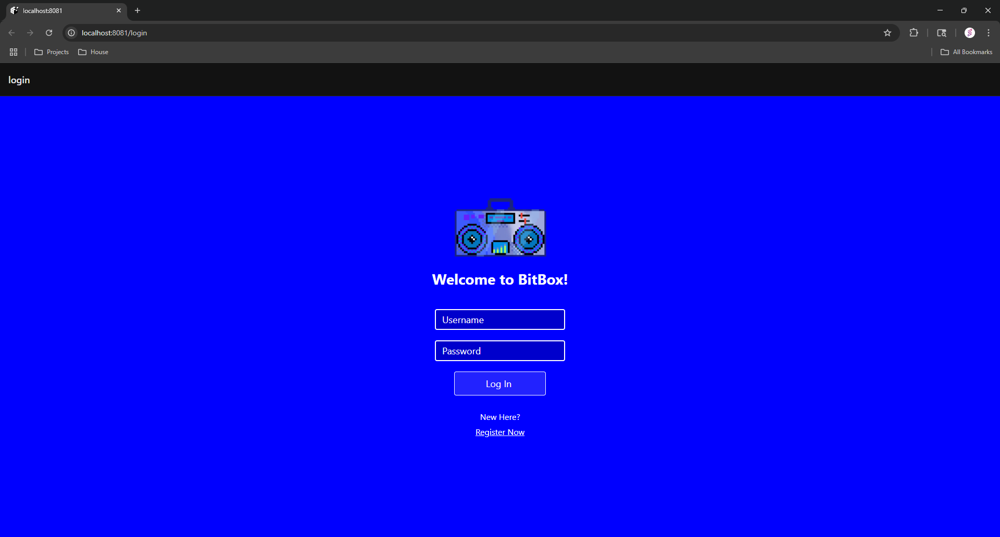
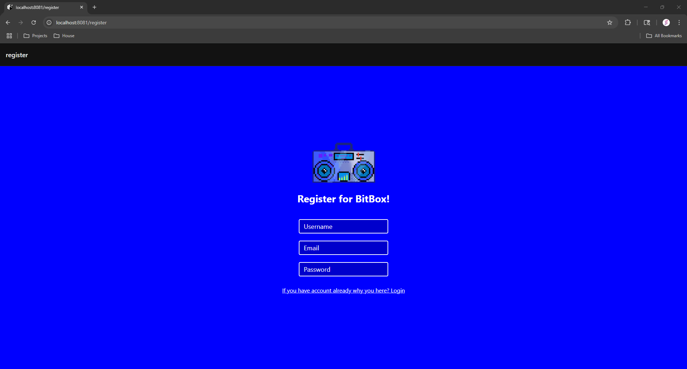
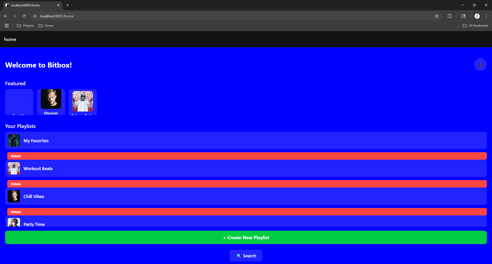
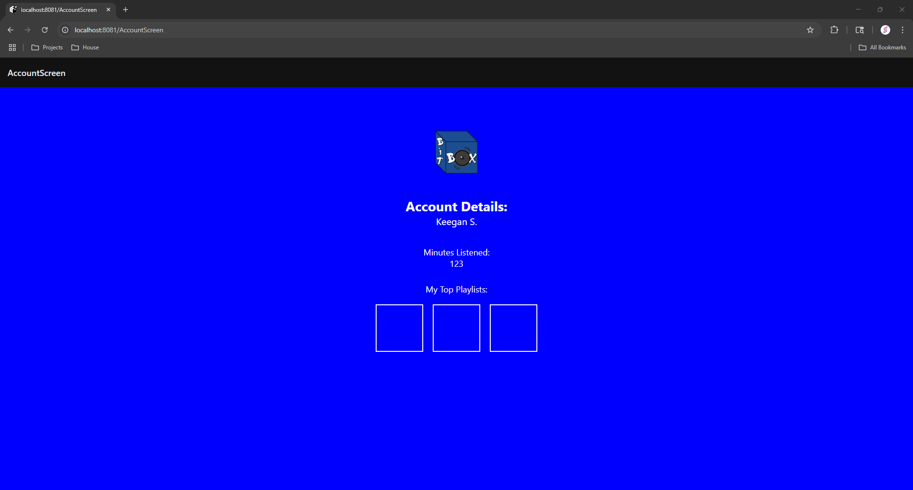
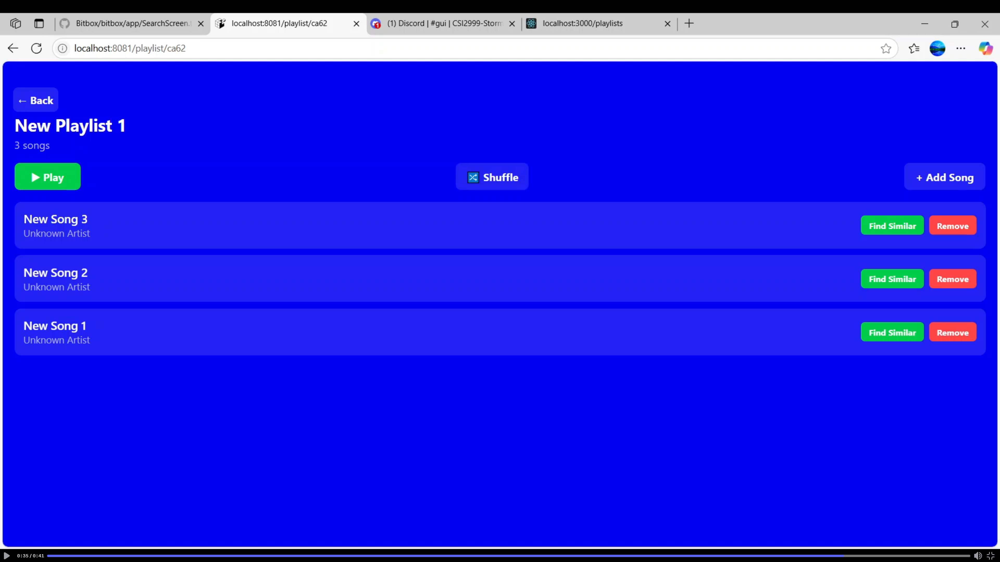
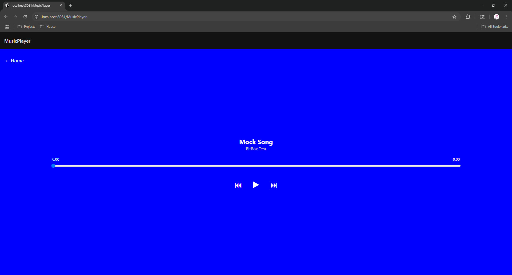

# **Bitbox GUI Overview**

Thank you for choosing Bitbox! This document provides a visual walkthrough of the Bitbox user interface. Each section contains a screenshot and a breakdown of the buttons and functionality present on the screen.

---

## **Login Page**

- If you have already made an account, you can enter your username and password in the boxes labeled as such.
- Once you have entered the correct information, click the "Log In" button to sign in.
- If you don't already have an account, you can left-click on the "Register Now" button to create an account.

---

## **Registration Page**

- When creating your account, fill out a username of your choice. Be creative! But make sure you write it down so you don’t forget it.
- In the "Email" box, please use your active email.
- Create a password of your choice.
- Finally, if you have accidentally clicked on the link to this page, you can go back to the login page by clicking the underlined text under the "Password" box.

---

## **Welcome Page**

- The "Featured" section shows suggested playlists based on user activity.
- "Your Playlists" is a collection of all the user's created playlists. Each playlist has the option to delete it using the red "Delete" button below the playlist.
- To create a new playlist, click the green button that says "+ Create New Playlist" at the bottom of the page.
- To search for songs/playlists, use the "Search" button below the new playlist button.
- Want to view account information? Use the circular icon in the top right to access your account details.

---

## **Account Details Page**

- The account details page is pretty self-explanatory, showing the user's name, total listening time, and the top 3 most-listened-to playlists.
- The user can click on any of the displayed playlists in the "My Top Playlists:" section to view that playlist.

---

## **Playlist Page**

- Basic information such as the playlist name, number of songs, and individual songs are shown on this page.
- To navigate back to the previous page, use the "Back" button in the top left.
- To add more songs to the playlist, use the "+ Add Song" button in the top right.
- You have the option to play the playlist from beginning to end using the "Play" button below the name of the playlist in the top left.
- To shuffle songs in the playlist randomly, use the "Shuffle" button in the top middle.
- To find a similar song to a song in your playlist, use the green "Find Similar" button on the right of the song tile.
- To remove a song, use the red "Remove" button to the right of the "Find Similar" button.

---

## **Now Playing Page**

- Song titles and artists are shown in the middle of the page.
- To go back to the home page, use the "Home" button in the top left.
- Using the progress bar, you can see the time played on the left and the time remaining on the right (for the current song).
- You can skip around in the song by clicking and dragging the blue dot in the progress bar.
- You can pause/play by using the button in the middle under the progress bar.
- To skip to the next song, use the button to the right of the play/pause button. To restart the song or go to the previous song, use the button to the left of the play/pause button.
